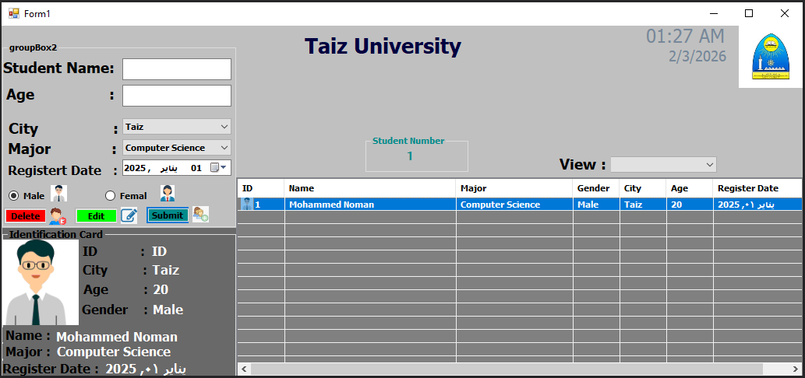

# 🎓 University — v1.0.0

  

  <strong>Student Management System</strong>
   
  C# • Windows Forms • Desktop Application

  <a href="#-overview">Overview</a>
  •
  <a href="#-features">Features</a>
  •
  <a href="#-screenshots">Screenshots</a>
  •
  <a href="#-technology">Technology</a>
  •
  <a href="#-project-structure">Structure</a>
.
  <a href="#-Timeline">Timeline</a>

---

## 📌 Overview

**University v1.0.0** is a lightweight desktop application built with **C# and Windows Forms** for managing university student records.

The application brings the main student management operations into a single interface, providing a simple workflow for working with student records and viewing their information.

---

## ✨ Features

| | Feature | Description |
|---|---|---|
| 👤 | **Student Management** | Add, edit, and delete student records from one interface. |
| 🪟 | **Unified Interface** | Manage the main student operations within a single window. |
| 🗂️ | **Visual Cards** | Display student information using a clear card-based layout. |
| 👁️ | **Custom Views** | Switch between available display modes such as Details and Small Icons. |

---

## 🖼️ Screenshots

<strong>🎓 Student Management — Dashboard</strong>

 

  

---

## 🛠️ Technology

| Technology | Purpose |
|---|---|
| **C#** | Core programming language |
| **.NET WinForms** | Desktop user interface |

---

## 📁 Project Structure

    University-v1.0.0/
    │
    ├── 📂 Properties/
    ├── 📂 Resources/
    ├── 📂 Screenshots/
    │   └── Student-Management.png
    │
    ├── Form1.cs
    ├── Form1.Designer.cs
    ├── Form1.resx
    │
    ├── Program.cs
    ├── App.config
    │
    ├── Project_Student.csproj
    ├── Project_Student.sln
    │
    ├── Universityico.ico
    └── README.md

---

## 📅 Timeline

| Version | Start Date | End Date | Language |
|:---:|:---:|:---:|:---:|
| **v1.0.0** | 2026/03/04 | 2026/03/05 | C# |

---

## 📦 Version

**v1.0.0**

---

## 👨‍💻 Author

**Mohammed Abdullah Noman Qaid Mohammed**

---

  <strong>🎓 University</strong>
   
  Simple Interface • Student Management • C# WinForms

